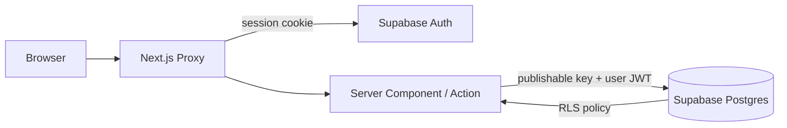

# VM Brake Lab Project Control

Internal project-control application for AP1 KDL Pipeline, AP2 ProMaster OEE, and AP3 ENV. Supabase is the single source of truth for tasks, questions, decisions, stakeholders, access requests, roadmap items, and activity. Changing project data never requires a code change or deployment.

## Architecture

- **Next.js 16 App Router + React 19:** Server Components load project data. Client Components are limited to navigation, forms, filters, dialogs, and table interaction.
- **Supabase Postgres:** all production project data lives in the eight `public` tables defined by the migration.
- **Supabase Auth + `@supabase/ssr`:** cookie-based sessions are refreshed in `src/proxy.ts` and verified again with `auth.getUser()` in protected layouts and every mutation.
- **Server Actions:** login, logout, and CRUD are POST mutations with Zod validation. No mutation is exposed through GET.
- **Vercel:** standard Next.js deployment with no paid add-ons or external APIs.



The publishable key identifies the Supabase project; it is not a secret. Authorization is enforced by the signed user session and database RLS. No service-role or secret key is used by the app.

## Local Installation

Prerequisites: Node.js 20 or newer, npm, and a free Supabase project.

```bash
npm install
cp .env.example .env.local
npm run dev
```

On PowerShell use `Copy-Item .env.example .env.local`. Open `http://localhost:3000`. The application requires a configured Supabase project and intentionally has no production mock-data fallback.

## Environment Variables

```dotenv
NEXT_PUBLIC_SUPABASE_URL=
NEXT_PUBLIC_SUPABASE_PUBLISHABLE_KEY=
```

- Find URL and publishable key in **Supabase > Project Settings > API**.
- The login password must never be placed in an environment variable, file, source code, log, or GitHub setting.
- Never add `SUPABASE_SERVICE_ROLE_KEY` or `SUPABASE_SECRET_KEY`. They are not needed.

`.env*` is ignored except for `.env.example`.

## Supabase Setup

1. Create a free Supabase project in the desired region.
2. Open **SQL Editor** and run `supabase/migrations/0001_initial_schema.sql`.
3. Run `supabase/seed.sql` once.
4. Open **Authentication > Providers > Email**. Keep email/password enabled; disable public user signup in **Authentication > Settings**.
5. In **Authentication > Users**, choose **Add user > Send invitation** and enter the user's real email address. Repeat for every authorized user.
6. Each invited user opens the confirmation link and sets their own password. For a manually created user, mark the email confirmed and provide the initial password through a secure channel.
7. Disable public signup and anonymous sign-ins. The application intentionally has no signup page.
8. Put the URL and publishable key in `.env.local`, then start the app.

The requested password is stored and hashed only by Supabase Auth. It is intentionally absent from this repository and its configuration.

## Migrations and Seed Data

The initial migration creates UUID keys with explicit deletion behavior, status/progress/date constraints, query indexes, automatic `updated_at` triggers, RLS, authenticated CRUD policies, and an explicit removal of all table privileges from `anon`.

For Supabase CLI workflows:

```bash
npx supabase login
npx supabase link --project-ref YOUR_PROJECT_REF
npx supabase db push
npx supabase db reset  # local environments only
```

The seed is initialization only. It records supplied facts and marks unknown points as `unknown`, `needs verification`, `Hypothesis – needs verification`, or `Unresolved term`. After initialization, edit data only through Supabase or this application.

## Authentication

The login form accepts the email and password of any authorized Supabase Auth user. The Server Action validates the email and submits both fields directly to Supabase Auth. Credentials are not retained by the application. Any invalid email, password, configuration, or provider response produces only `Invalid email or password.` User accounts are created or invited in **Supabase > Authentication > Users**; adding a user does not require environment-variable changes or a deployment.

`src/proxy.ts` performs an early route check and refreshes cookies. This is not the authorization boundary: the protected layout and all Server Actions call `auth.getUser()` so Supabase verifies the user server-side. Logout invalidates the local Supabase session and redirects to `/login`.

## Security Model and RLS

- Every route except `/login` is protected.
- Every project table has RLS enabled. `anon` has no table privileges and no policies.
- Authenticated users receive explicit select, insert, update, and delete policies.
- Server Actions re-check authentication and validate all accepted fields using Zod.
- The browser receives no service-role key, password, or static project dataset.
- A per-request nonce CSP permits same-origin code and the configured Supabase connection; `frame-ancestors 'none'` prevents framing.
- Responses include `nosniff`, `no-referrer`, a restrictive Permissions Policy, `X-Robots-Tag`, and production HSTS.
- `robots.txt` disallows all crawling and metadata sets `noindex, nofollow`.
- Browser source maps and the `X-Powered-By` header are disabled.
- UI errors are generic. Detailed Supabase/Auth failures are not returned to clients.
- Delete requires confirmation. Activity records are never automatically removed.

RLS is the final database boundary, including for direct Supabase clients. The current policies deliberately permit every authenticated user to manage all project records. Introduce roles or project membership before inviting users who should have restricted access.

## Vercel Deployment

1. Push this repository to GitHub without `.env.local`.
2. In Vercel choose **Add New > Project**, import the repository, and keep the detected Next.js settings.
3. Add the two variables from `.env.example` for Production and Preview. Never add a password or a Supabase secret/service-role key.
4. Deploy. Vercel uses `npm run build`.
5. In **Supabase > Authentication > URL Configuration**, set **Site URL** to the production Vercel HTTPS URL. Add required preview URLs only when previews need authentication.
6. Verify `/login`, login, logout, a create/edit/delete cycle, and security response headers.

HTTPS is supplied by Vercel. Production responses enable HSTS.

## Adding Tables or Features

1. Add a numbered, forward-only SQL migration under `supabase/migrations/`.
2. Add keys, constraints, indexes, RLS, explicit policies, grants/revokes, and `updated_at` handling.
3. Extend `src/lib/database.types.ts` or replace it with generated Supabase types.
4. Add a Zod schema in the relevant Server Action. Never accept arbitrary table names or unvalidated columns.
5. Load data in a Server Component or `src/lib/data.ts`; do not bundle project records as constants.
6. Add focused tests, including unauthenticated database behavior when permissions change.
7. Run all quality commands below.

## ChatGPT Data Maintenance

No proprietary middleware is required. A future authorized ChatGPT connector can use the Supabase REST API or Postgres connection against clear table names and stable codes such as `AP1-T01`, `AP1-Q01`, and `AP1-D01`.

1. Create a dedicated Supabase Auth user for the connector only after extending RLS beyond the current single-user model.
2. Store its credential in the connector's secure secret store, never in conversation text, source code, browser storage, or this repository.
3. Use a short-lived authenticated session and the publishable key. Do not expose the service-role key.
4. Find an entity by its unique code, update approved columns, then insert a matching `activity_log` row with `source = 'chatgpt'`.
5. Read the updated row back to confirm the operation.

Example: select `tasks` where `task_code = 'AP1-T01'`; update its status; insert a summary into `activity_log`. Direct writes remain governed by RLS. If automation needs narrower access, add connector-specific claims and RLS policies first.

## Quality Checks

```bash
npm test
npm run lint
npm run typecheck
npm run build
```

Tests cover successful and failed login, logout, unauthenticated redirects, authenticated protected routes, validated CRUD with activity logging, and the SQL RLS/anonymous-access contract.

## Troubleshooting

**`Supabase is not configured.`**  
Verify `.env.local`, restart `npm run dev`, and match names in `.env.example`.

**Every login fails.**  
Confirm the Supabase user uses the entered email, is confirmed, and email/password auth is enabled. The UI intentionally gives no more specific error.

**Redirect loop between `/login` and `/`.**  
Clear site cookies, verify URL/key belong to the same project, and check the production Site URL.

**Tables are empty or requests return permission errors.**  
Run migration before seed, verify the user is authenticated, and inspect Supabase logs. Do not weaken RLS or add an `anon` policy.

**Seed fails on a second run.**  
Core coded entities use conflict handling; roadmap, access, and activity initialization targets a clean database. Seed only once in production. Use `supabase db reset` only for disposable local databases.

**CSP blocks Supabase.**  
Ensure `NEXT_PUBLIC_SUPABASE_URL` is present at build and runtime and redeploy. The CSP derives `connect-src` from that value.

**npm returns `E401`.**  
Remove or refresh stale credentials in the user's npm configuration. Public dependencies require no npm authentication.

**Build succeeds locally but fails on Vercel.**  
Check all four environment variables in that Vercel environment and use a supported Node.js version. Do not add secret keys.
